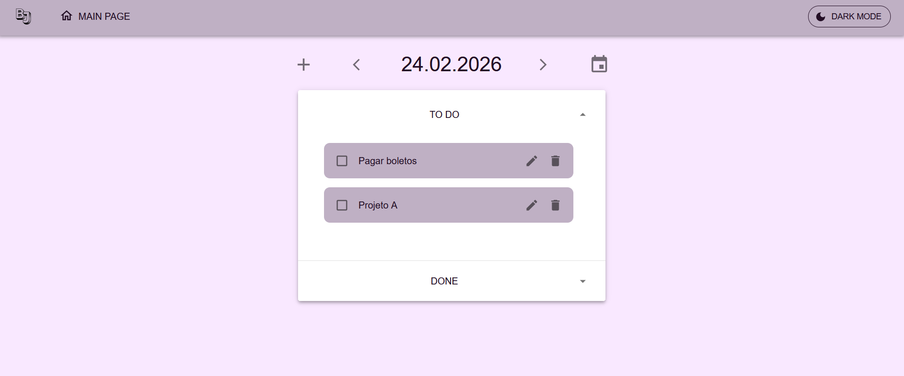
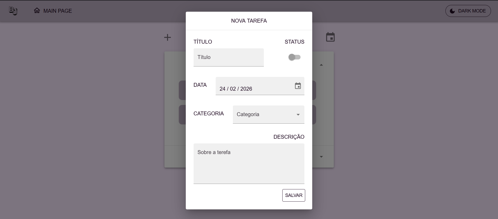
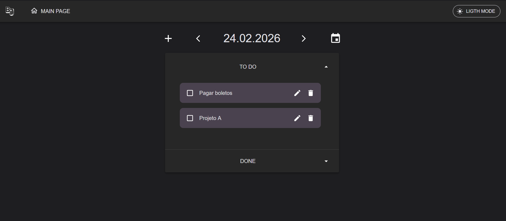

# BuJout

Aplicação web inspirada na metodologia bullet journal para organizar tarefas por dia, separando entre **To Do** e **Done**, com navegação simples entre datas e reordenação via drag-and-drop.

## Demo
- [Assista ao vídeo](docs/demo.mp4)
- Main Page
- Dialog Task
- Dark Mode

## Principais features
- CRUD de tarefas  
- Alteração de status  
- Navegação por data (ontem/amanhã e por calendário)
- Reordenação com drag-and-drop  
- Loading states (skeleton)
- Dark Theme

## Stack
- React + TypeScript
- Vite
- Material UI
- React Router
- Day.js
- dnd-kit
- ESLint

---  

## Como rodar

Clone este repositório e o backend (https://github.com/anaclaraoliv/bj-backend), execute o script de criação do banco fornecido no backend e rode ambos localmente.
 